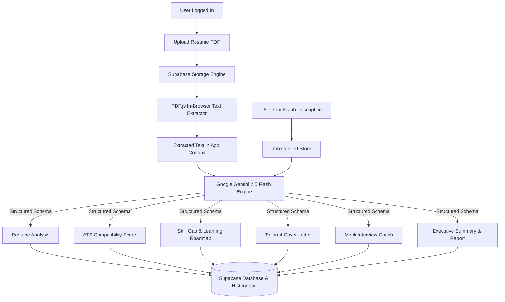

# HireReady AI — Next-Gen AI Career Engine

[](https://hire-ready-ai-rose.vercel.app/)
[](https://react.dev/)
[](https://vitejs.dev/)
[](https://tailwindcss.com/)
[](https://supabase.com/)
[](https://ai.google.dev/)
[](LICENSE)

> **HireReady AI** is an end-to-end, AI-powered career optimization platform designed to bridge the gap between job seekers and Applicant Tracking Systems (ATS). Powered by Google Gemini AI and Supabase, HireReady AI shreds resume PDFs, compares them against target job descriptions, computes ATS compatibility scores, identifies skill gaps, crafts tailored cover letters, provides an interactive mock interview coach, and compiles executive matching reports.

🔗 **Live Production URL**: [https://hire-ready-ai-rose.vercel.app/](https://hire-ready-ai-rose.vercel.app/)

---

## 📌 Table of Contents

- [Overview & Problem Statement](#-overview--problem-statement)
- [Target Users](#-target-users)
- [Application Architecture & Workflow](#-application-architecture--workflow)
- [Complete Implemented Features](#-complete-implemented-features)
- [Deep Dive: AI Implementation & Gemini Integration](#-deep-dive-ai-implementation--gemini-integration)
- [UI Screenshots](#-ui-screenshots)
- [Tech Stack & Tools](#-tech-stack--tools)
- [Installation & Local Setup](#-installation--local-setup)
- [Environment Variables](#-environment-variables)
- [Project Directory Structure](#-project-directory-structure)
- [Technical Challenges & Solutions](#-technical-challenges--solutions)
- [Key Learning Outcomes](#-key-learning-outcomes)
- [Future Improvements](#-future-improvements)
- [Author & License](#-author--license)

---

## 💡 Overview & Problem Statement

### The Real-World Problem
Modern hiring relies heavily on automated **Applicant Tracking Systems (ATS)** that filter out over **75% of qualified applicants** before a human recruiter ever sees their application. Candidates struggle with:
1. **Opaque ATS Filters**: Inability to know how well their resume matches specific job keywords.
2. **Generic Applications**: Sending out non-tailored resumes and cover letters that fail to highlight job-relevant achievements.
3. **Skill Blindspots**: Difficulty identifying exact technical or soft skill gaps required for a dream role.
4. **Interview Unpreparedness**: Lack of personalized, role-specific interview coaching and feedback.

### The Solution: HireReady AI
HireReady AI acts as a personal AI career strategist. By ingesting a candidate's resume PDF and a target job description, it leverages Google Gemini AI to analyze application competitiveness, optimize terminology for ATS algorithms, map out step-by-step learning roadmaps, generate customized cover letters, and evaluate mock interview performance in real time.

---

## 🎯 Target Users

| User Persona | Key Benefits & Use Case |
| :--- | :--- |
| 🎓 **Recent Graduates & Entry-Level** | Identify missing industry skills, optimize first resumes for ATS, and practice foundational technical interview questions. |
| 🔄 **Career Switchers** | Translate transferable skills into role-aligned keywords for new industries and generate tailored narrative cover letters. |
| 💼 **Experienced Professionals** | Executive-level match scoring, deep competitive gap analysis, and tailored high-impact application materials. |

---

## 🔄 Application Architecture & Workflow

HireReady AI uses a modern client-heavy architecture backed by Supabase for authentication and relational storage, alongside Google Gemini 2.5 Flash for high-speed generative intelligence.



---

## ✨ Complete Implemented Features

### 1. 🔐 Authentication & Session Management
- **Supabase Authentication**: Secure Email/Password registration, login, session persistence, and password resets.
- **Protected Layout**: Route-level protection enforcing active user session across all career modules.

### 2. 📄 PDF Text Extraction & Resume Management
- **Client-Side PDF Shredding**: Uses `pdfjs-dist` to parse ArrayBuffers directly from Supabase Storage without relying on heavy backend server dependencies.
- **Resume Multi-Version Context**: Stores active resume state across application modules.

### 3. 💼 Job Description Targeting Engine
- Stores targeted job descriptions dynamically linked with the candidate's active profile and resume.

### 4. 🧠 AI Resume Analysis (Strengths & Weaknesses)
- Evaluates resume structure, impact metrics, action verbs, and formatting readability.
- Highlights concrete strengths and actionable weaknesses.

### 5. 🎯 AI ATS Compatibility Score & Keyword shredded gap
- Calculates precise numerical match percentage (0–100%).
- Categorizes **Matching Keywords** (present in resume) and **Missing Keywords** (required by job posting).

### 6. 🗺️ AI Skill Gap Analysis & Learning Roadmap
- Identifies critical technical & soft skill deficiencies.
- Builds a step-by-step, actionable career learning plan.

### 7. ✍️ AI Tailored Cover Letter Generator
- Crafts customized, professional cover letters tailored to the candidate's experience and target job requirements.
- Multiple tone options (Professional, Enthusiastic, Executive).
- One-click copy to clipboard and `.txt` file export.

### 8. 🎙️ AI Interactive Mock Interview Coach
- Generates role-specific behavioral and technical interview questions based on the candidate's exact resume and job description.
- Evaluates user answers and delivers instant constructive feedback with score ratings.

### 9. 🏆 Executive Summary & Holistic Match Report
- Computes an aggregate competitive heuristic score displayed in a high-contrast circular score gauge.
- Generates a downloadable executive report.

### 10. ⚡ 3-Tier Subscription & Limit Manager
- **Free Plan**: Up to **2 Resumes** ($0/mo)
- **Pro Plan**: Up to **5 Resumes** ($9.99/mo)
- **Premium Plan**: Up to **10 Resumes** ($19.99/mo)
- Dynamic sidebar usage progress indicator and transparent tier management page (`/pricing`).

### 11. 📜 Activity History Audit Log
- Persists all past resume scans, ATS matches, cover letters, and reports in a queryable history stream.

---

## 🤖 Deep Dive: AI Implementation & Gemini Integration

HireReady AI leverages **Google Gemini 2.5 Flash** (`@google/genai` SDK) for high-speed, structured generative responses.

### 1. Enforced JSON Schema (`responseSchema`)
To guarantee 100% reliable UI rendering without JSON parsing errors, every Gemini invocation enforces strict OpenAPI-compliant schemas.

```javascript
// Example: ATS Score Schema Definition
const atsSchema = {
  type: Type.OBJECT,
  properties: {
    score: { type: Type.INTEGER },
    matching_keywords: { type: Type.ARRAY, items: { type: Type.STRING } },
    missing_keywords: { type: Type.ARRAY, items: { type: Type.STRING } }
  },
  required: ["score", "matching_keywords", "missing_keywords"]
};
```

### 2. Resilient API Execution with Exponential Backoff
To handle API quota limits (HTTP 429), HireReady AI implements an exponential backoff wrapper that parses Gemini SDK rate-limit delay headers (`retry in X.Xs`) and automatically retries requests seamlessly.

```javascript
async function generateSafeContent(prompt, responseSchema, maxRetries = 3) {
  for (let attempt = 1; attempt <= maxRetries; attempt++) {
    try {
      const response = await getAIClient().models.generateContent({
        model: 'gemini-flash-latest',
        contents: prompt,
        config: { responseMimeType: "application/json", responseSchema }
      });
      return JSON.parse(response.text);
    } catch (err) {
      if (err?.status === 429 && attempt < maxRetries) {
        // Extract exact retry delay from SDK error message
        const match = err?.message?.match(/retry in ([\d.]+)s/i);
        const waitTime = match ? parseFloat(match[1]) * 1000 + 1000 : 2000 * Math.pow(2, attempt - 1);
        await new Promise(res => setTimeout(res, waitTime));
        continue;
      }
      throw err;
    }
  }
}
```

### 3. System Prompts & AI Instructions Behind Core Features

The table below documents the exact instructions and prompts engineered for each AI module in [gemini.js](file:///c:/Users/PMYLS/Desktop/hire-ready-ai/src/lib/gemini.js):

| AI Feature | AI Purpose & Instruction Prompt | Output Format Schema |
| :--- | :--- | :--- |
| **1. Resume Analysis** | `"Analyze this resume against the target job description. Extract core strengths and distinct weaknesses/areas to improve."` | `{ strengths: [], weaknesses: [] }` |
| **2. ATS Matcher** | `"Act as a strict Applicant Tracking System (ATS). Compare resume terminology to job requirements. Calculate integer score out of 100, matching keywords, and missing required keywords."` | `{ score: 85, matching_keywords: [], missing_keywords: [] }` |
| **3. Skill Gap & Roadmap** | `"Contrast resume against job requirements. Identify missing hard technical and soft skills. Fabricate a 3-step practical learning roadmap with phase, task, project_idea, estimated_time, and impact_level."` | `{ missing_technical: [], missing_soft: [], roadmap: [{ phase, task, project_idea, estimated_time, impact_level }] }` |
| **4. Cover Letter Generator** | `"Write a compelling, professional cover letter targeted towards this exact position leveraging experience in the resume. Human, punchy, under 350 words with quantifiable achievements."` | `{ content: "..." }` |
| **5. Interview Questions & Evaluation** | `"You are a strict technical hiring manager. Generate 10 relevant interview questions (4 technical, 3 behavioral STAR, 2 system architecture, 1 team leadership). Evaluate candidate answers 0-100 with feedback."` | Questions: `[string]`, Feedback: `{ score: 90, feedback: "..." }` |
| **6. Executive Summary Report** | `"Provide a conclusive executive summary (3-4 sentences) dictating whether candidate is highly competitive, moderately aligned, or under-qualified. Include holistic match score out of 100."` | `{ overall_score: 88, summary: "..." }` |

---

## 📸 UI Screenshots

> *Note: Place your application screenshots into the `docs/screenshots/` directory using the filenames specified below.*

### 1. Landing Page


**Hero section highlighting HireReady AI's core capabilities, features showcase, and value proposition.**

### 2. Authentication (Login / Signup)


**Secure email and password authentication powered by Supabase Auth.**

### 3. Dashboard


**Overview of active resume, target job description, recent activity stream, and quick module actions.**

### 4. Resume Upload and Job Description
 

**Drag-and-drop PDF resume upload with in-browser text extraction and job description saving.**

### 5. Resume Analysis


**AI-driven structural analysis breaking down resume strengths and weaknesses.**

### 6. ATS Compatibility Matching


**ATS compatibility gauge displaying percentage score, matching keywords, and missing keywords.**

### 7. Skill Gap & Learning Roadmap
 

**Intelligent AI skill gap detection that compares your resume against target job requirements and generates a personalized learning roadmap with actionable recommendations to strengthen your profile.**

### 8. Cover Letter Generator
 

**Custom cover letter generator with multi-tone selection, instant preview, and export controls.**

### 9. Executive Summary Report


**Holistic match score gauge and executive summary report.**

---

## 🛠️ Tech Stack & Tools

| Component | Technology | Description |
| :--- | :--- | :--- |
| **Frontend Framework** | **React 18 + Vite 5** | Single Page Application with fast HMR and optimized production bundling. |
| **Styling & Icons** | **Tailwind CSS 3 + Lucide React** | Responsive design system supporting dark/light theme modes and glassmorphism UI. |
| **Routing & State** | **React Router DOM 6 + Context API** | SPA routing with global `AppContext` for active resume/job state management. |
| **Backend & Auth** | **Supabase (PostgreSQL + Auth)** | User authentication, row-level security, and activity logging database. |
| **Cloud Storage** | **Supabase Storage** | Secure storage bucket for resume PDF files. |
| **AI / Machine Learning** | **Google Gemini 2.5 Flash** | Advanced GenAI SDK (`@google/genai`) for structured analysis & content generation. |
| **Document Shredder** | **PDF.js (`pdfjs-dist`)** | Browser-native PDF text extraction from ArrayBuffer payloads. |
| **Hosting & Deployment** | **Vercel** | Automated CI/CD production deployment linked with GitHub `main` branch. |

---

## 💻 Installation & Local Setup

Follow these steps to run HireReady AI locally on your computer:

### Prerequisites
- **Node.js**: v18.0.0 or higher
- **npm** or **yarn**
- **Git**

### Step-by-Step Guide

1. **Clone the Repository**:
   ```bash
   git clone https://github.com/unsa-memon/hire-ready-ai.git
   cd hire-ready-ai
   ```

2. **Install Dependencies**:
   ```bash
   npm install
   ```

3. **Configure Environment Variables**:
   Create a `.env.local` file in the root directory (see format below).

4. **Start Development Server**:
   ```bash
   npm run dev
   ```
   Open `http://localhost:5173` in your browser.

5. **Build for Production**:
   ```bash
   npm run build
   ```

---

## 🔑 Environment Variables

Create a `.env.local` file in the project root directory with the following structure:

```env
# Supabase Configuration
VITE_SUPABASE_URL=https://your-supabase-project-id.supabase.co
VITE_SUPABASE_ANON_KEY=your-supabase-anon-key-here

# Google Gemini AI Configuration
VITE_GEMINI_API_KEY=your-google-gemini-api-key-here
```

> ⚠️ **Security Warning**: Never commit your actual API keys or secrets to public repositories. `.env.local` is listed in `.gitignore`.

---

## 📂 Project Directory Structure

```text
hire-ready-ai/
├── public/                     # Static assets (favicon, logos)
├── src/
│   ├── components/             # Reusable UI components & layouts
│   │   ├── ui/                 # UI primitives (Button, Card, Badge, Progress)
│   │   ├── Layout.jsx          # Protected route master layout
│   │   ├── Navbar.jsx          # Top navigation bar
│   │   ├── ProtectedRoute.jsx  # Auth guard wrapper
│   │   └── Sidebar.jsx         # Sidebar navigation & tier usage widget
│   ├── context/                # Global React Context providers
│   │   ├── AppContext.jsx      # Resume, job, and subscription state
│   │   └── AuthContext.jsx     # Supabase auth session provider
│   ├── lib/                    # API clients and helpers
│   │   ├── gemini.js           # Google Gemini AI integration & PDF shredder
│   │   ├── supabase.js         # Supabase client initialization
│   │   └── utils.js            # Tailwind merge & utility functions
│   ├── pages/                  # Application page components
│   │   ├── AtsScore.jsx        # ATS match score page
│   │   ├── CheckEmail.jsx      # Auth confirmation page
│   │   ├── CoverLetter.jsx     # Cover letter generator page
│   │   ├── Dashboard.jsx       # Main user portal dashboard
│   │   ├── FinalReport.jsx     # Executive summary report page
│   │   ├── ForgotPassword.jsx  # Password recovery page
│   │   ├── History.jsx         # Activity history log page
│   │   ├── InterviewCoach.jsx  # AI mock interview prep page
│   │   ├── JobDescription.jsx  # Target job description input page
│   │   ├── LandingPage.jsx     # Marketing landing page
│   │   ├── Login.jsx           # Sign-in page
│   │   ├── Pricing.jsx         # 3-tier subscription management page
│   │   ├── ResumeAnalysis.jsx  # Strengths & weaknesses analysis page
│   │   ├── ResumeUpload.jsx    # PDF resume upload page
│   │   ├── Signup.jsx          # Registration page
│   │   └── SkillGap.jsx        # Skill gap & career roadmap page
│   ├── App.jsx                 # App routing definition
│   ├── index.css               # Global CSS & Tailwind setup
│   └── main.jsx                # Application entry point
├── .env.local                  # Local environment variables (Git ignored)
├── .gitignore                  # Git exclusion rules
├── package.json                # NPM dependencies & scripts
├── README.md                   # Project documentation
├── vercel.json                 # Vercel deployment routing config
└── vite.config.js              # Vite bundler configuration
```

---

## ⚡ Technical Challenges & Solutions

### Challenge 1: Extracting Clean Text from PDF Files Client-Side
- **Issue**: Standard backend PDF parsing libraries require Node.js native bindings (like `fs`), which fail in client-side Vite builds.
- **Solution**: Implemented `pdfjs-dist` to download PDF blobs directly via the Supabase Storage SDK as ArrayBuffers, iterating over PDF page canvas text streams in pure client-side JavaScript.

### Challenge 2: Unreliable LLM JSON Responses
- **Issue**: Large Language Models sometimes return conversational filler text or malformed JSON, breaking front-end React components.
- **Solution**: Configured Google GenAI SDK `responseSchema` with strict OpenAPI TypeScript/JSON types (`Type.OBJECT`, `Type.ARRAY`), enforcing 100% deterministic JSON shapes directly from Gemini.

### Challenge 3: Gemini API 429 Quota Rate Limiting
- **Issue**: Concurrent requests or rapid module switching triggered 429 Rate Limit errors from Google Gemini API.
- **Solution**: Built a universal `generateSafeContent` wrapper with Exponential Backoff Retries. Used regex to extract Google's exact `retry in X.Xs` header delay, automatically holding requests until the rate limiter cleared.

### Challenge 4: Sidebar Layout Overflow & Cut-Off UI
- **Issue**: Outer sidebar containers with `overflow-y-auto` pushed the subscription card and Logout buttons off-screen on smaller displays.
- **Solution**: Re-architected the layout to keep the sidebar header and footer fixed (`flex-shrink-0`), placing `overflow-y-auto` strictly on the middle navigation menu element.

---

## 🧠 Key Learning Outcomes

1. **Production-Grade Generative AI Integration**: Mastering structured response schemas, prompt engineering, and rate-limit handling using Google Gemini API.
2. **Full-Stack Serverless Architecture**: Building complete authentication, row-level security, and file storage workflows using Supabase.
3. **Advanced React Patterns**: Managing dynamic global state, persistent user context, and custom hooks across complex multi-page SPAs.
4. **Client-Side Binary File Processing**: Shredding PDF document streams directly in the browser via ArrayBuffers and PDF.js.
5. **Modern UI/UX Engineering**: Designing responsive interfaces with Tailwind CSS, custom scrollbars, dark/light themes, and glassmorphism.

---

## 🔮 Future Improvements

- [ ] **Voice-Driven Mock Interviews**: Integrate WebRTC and Web Speech API for real-time vocal mock interview practice.
- [ ] **Automated LinkedIn Profile Optimizer**: Extend Gemini analysis to optimize LinkedIn headlines, summaries, and experience sections.
- [ ] **Live Job Board Integration**: Fetch live job postings directly from API providers (LinkedIn, Indeed) to auto-populate job descriptions.
- [ ] **Export to PDF/Word**: Generate downloadable `.pdf` and `.docx` formatted resumes and cover letters directly.

---

## 👥 Author & License

**Author**: Unsa Memon  
**Live Project**: [https://hire-ready-ai-rose.vercel.app/](https://hire-ready-ai-rose.vercel.app/)  
**GitHub Repository**: [https://github.com/unsa-memon/hire-ready-ai](https://github.com/unsa-memon/hire-ready-ai)

### License
This project is licensed under the **MIT License** — see the [LICENSE](LICENSE) file for details.

---

<p center align="center">
  Made with ❤️ by <strong>Unsa Memon</strong>.
</p>
